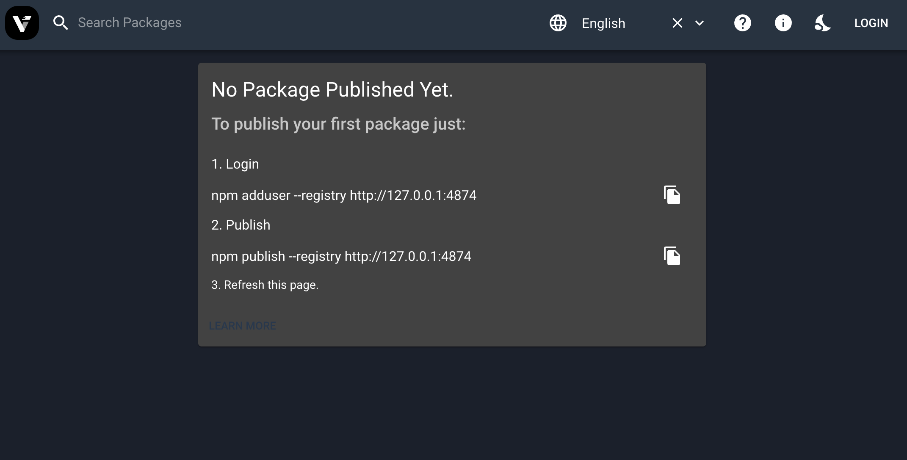
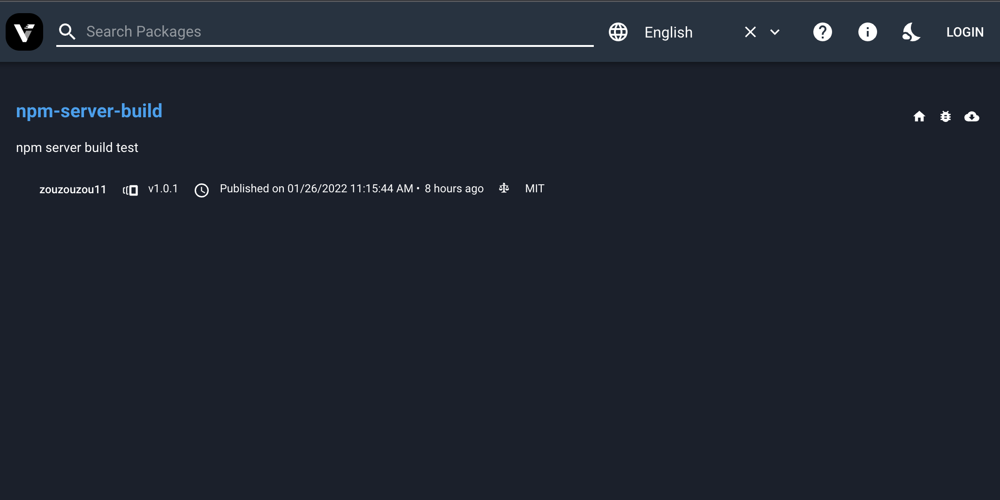

# verdaccio

## 安装
yarn install verdaccio
## 运行
yarn verdaccio --config ./default.yaml
> 与default.yaml 不同的地方 增加了 listen: 127.0.0.1:4874



## 发布包
1. 设置npm包源 or yarn包源
```bash
npm set registry http://127.0.0.1:4874
```
或
```bash
yarn config set registry http://127.0.0.1:4874
```
2. 注册用户，会有一系列的name password email填
```bash
 npm adduser --registry http://127.0.0.1:4874
```
3. 登录用户,输入你注册的用户
```bash
 npm login
```
4. 登录账户校验
```bash
 npm whoami
```
5. 上传或更新包(若更新包需改version)
```bash
 npm publish
```
6. 如图上传更新了npm-server-build包


## 使用包
1. 发布包的步骤一
2. npm install 'yourPackageName' or yarn add 'yourPackageName'

## Apache反向代理部署
```bash
    cd /private/etc/apache2/
    code httpd.conf
```
> httpd.conf反向代理，/为根节点
```yaml
# 反向代理开启
LoadModule proxy_module libexec/apache2/mod_proxy.so
LoadModule proxy_connect_module libexec/apache2/mod_proxy_connect.so
LoadModule proxy_ftp_module libexec/apache2/mod_proxy_ftp.so
LoadModule proxy_http_module libexec/apache2/mod_proxy_http.so
LoadModule slotmem_shm_module libexec/apache2/mod_slotmem_shm.so
LoadModule ssl_module libexec/apache2/mod_ssl.so
# 节点设置
 <VirtualHost *:80>
    AllowEncodedSlashes     NoDecode
    ProxyPass               /       http://127.0.0.1:4874/ nocanon
    ProxyPassReverse        /       http://127.0.0.1:4874/
</VirtualHost>
```

## 填坑记录
### verdaccio 5.x proxy bug
> 当使用5.x版本时,再使用apache代理时，将会出现跨域问题:
#### 问题
```text
CircularProgress.js:120 
Uncaught DOMException: Failed to execute 'pushState' on 'History': A history state object with URL 'http://0.0.0.0:4874/' cannot be created in a document with origin 'http://127.0.0.1' and
```
#### 解决
 目前暂时使用verdaccio 4.x 降级解决

### verdaccio 5.x ,4.x 出现 使用其他域访问是出现问题
> 如 0.0.0.0 使用localhost方法
#### 问题
```text
main.06493eae2f534100706f.js:2 Refused to connect to 'http://0.0.0.0:4873/-/verdaccio/data/packages' because it violates the following Content Security Policy directive: "connect-src 'self'".
```
#### 解决
> 修改verdaccio的中间件文件(build/api/middleware.js),将connect-src设为正确的值,或者可以注释掉相关代码
```javascript
// verdaccio安装目录/build/api/middleware.js
function setSecurityWebHeaders(req, res, next) {
  // disable loading in frames (clickjacking, etc.)
  res.header(_constants.HEADERS.FRAMES_OPTIONS, 'deny'); // avoid stablish connections outside of domain
  // zouzouzou 注释修改这里
  // res.header(_constants.HEADERS.CSP, "connect-src 'self'"); // https://stackoverflow.com/questions/18337630/what-is-x-content-type-options-nosniff

  res.header(_constants.HEADERS.CTO, 'nosniff'); // https://stackoverflow.com/questions/9090577/what-is-the-http-header-x-xss-protection

  res.header(_constants.HEADERS.XSS, '1; mode=block');
  next();
}
```

### pm2 无法执行npm or yarn 指令
#### 问题
```bash
PM2] Starting /usr/local/bin/npm in fork_mode (1 instance)
[PM2] Done.
[PM2][ERROR] Script not found: /Users/zou/Downloads/github/npmServerBuild/run
error Command failed with exit code 1.
```
#### 解决
> 用运行verdaccio.js代替
```javascript
const { exec } = require('child_process');
exec('yarn dev');//ro exec('npm run dev') //dev 是你的commond name
```
> 指令
```bash
yarn pm2 start ./verdaccio.js 
```